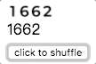

# number-flip
[](https://nodei.co/npm/number-flip/)


Change number with flipping animation




[demo on codepen](https://codepen.io/gaoryrt/pen/oyyMBx)

# install
```
$ npm install --save number-flip
```

# usage
## import `number-flip`
```
import { Flip } from 'number-flip'
```

## use it!
### create one and make it flip:
```js
new Flip({
  node: $('.flip'),
  from: 9527,
  to: 42
})
```

### flip one with delay:
```js
new Flip({
  node: $('.flip'),
  from: 9527,
  to: 42,
  delay: 1 // second
})
```

### create one and flip it later:
```js
const el = new Flip({
  node: $('.flip'),
  from: 9527
})

el.flipTo({to: 42})
```

### costumize animate duration:
```js
new Flip({
  node: document.querySelector('.flip'),
  from: 9527,
  to: 42,
  duration: 2 // second
})
```

### more complex usage
```js
new Flip({
  node: document.querySelector('.flip'),
  from: 73,
  to: 25,
  duration: 2,
  delay: 1,
  easeFn: function(pos) {
    if ((pos/=0.5) < 1) return 0.5*Math.pow(pos,3);
    return 0.5 * (Math.pow((pos-2),3) + 2);
  },
  // for more easing function, see https://github.com/danro/easing-js/blob/master/easing.js
  systemArr: ['零', '壹', '贰', '叁', '肆', '伍', '陆', '柒', '捌', '玖']
})
```

### CSS customizable:
HTML structure of a 3-digits flip would be like:
```
.number-flip
    .ctnr.ctnr0
        .digit*10
    .ctnr.ctnr1
        .digit*10
    .ctnr.ctnr2
        .digit*10
```

The height / width of `.number-flip` is based on the height / width of `.digit`, you can customize the size by changing the css of `.digit`:
```css
  .number-flip { ... }
  .ctnr { ... }
  .digit { ... }
```

### Separator:
Spearator allowed

```js
new Flip({
  node: $('.flip'),
  from: 95279527,
  separator: ','
})
```

even more

```js
new Flip({
  node: $('.flip'),
  from: 95279527,
  separator: ['万', '亿', '兆'],
  separateEvery: 4
})
```

# syntax

```js
var flipInstance = new Flip(options)
flipInstance.flipTo(instanceOptions)
```

## return value
The returned Flip instance has a function called `flipTo`.  
`flipTo` takes one `instanceOptions`, so you can start the flip animation whenever you want.

## parameter
**`options`**

- `node`: An `Element` object representing the animation container. Make sure this element is already existed in the DOM when you `new` the instance.
- `from`: The number that animation starts from. `Optional` if you want to flip with 0. Expected a positive integer.
- `to`: The number that animation rolls to. `Optional` if you want to start manually. Expected a positive integer.
- `duration` `optional`: The animation duration in seconds. If not specified, `duration` defaults to 0.5 second.
- `delay` `optional`: The delay of animation in seconds. If not specified, there's no `delay`.
- `easeFn` `optional`: A easing function to be executed. If not specified, `easeFn` defaults [easeInOutCubic](https://github.com/danro/easing-js/blob/4f5e7edbde7f7200a1baf08e357377896c0d207e/easing.js#L39-L42).
- `systemArr` `optional`: An array ten-lengthed, representing the content of each decimal rolling system. If not specified, `systemArr` defaults to `[ 0, 1, 2, 3, 4, 5, 6, 7, 8, 9 ]`.
- `direct` `optional`: A boolean representing if the number would rolling directly or one by one. For example, from 0 to 99, the ones place would pass 9 digits if is direct. Or if is not directly, would pass 99 digits, 9 rounds for each of the tens place. If not specified, `direct` defaults `true`.
- `separator`: A string / array representing the separator, defaults off. Could set to a string or an array-of-string.
- `separateEvery`: The number per digit separator would add to, defaults `3`.
- `maxLenNum` `optional`: A number representing the number of digits, if not specified, length of digits would fits the [`maxLenNum`](https://github.com/gaoryrt/number-flip/blob/9d0e554155339502316121318bde7bf5ae57df5d/number-flip.js#L3) of given `from` and `to`. Otherwise, length of digits won't change (see more at [this issue](https://github.com/gaoryrt/number-flip/issues/5)).

**`instanceOptions`**

- `to`: Same as `options.to`.
- `duration` `optional`: Same as `options.duration`.
- `easeFn` `optional`: Same as `options.easeFn`.
- `direct` `optional`: Same as `options.direct`.


# TODO
- [x] flip with FLIP
- [x] syntax
- [ ] browser compatibility list

# license
MIT

# contributing
1. fork this repo
2. `git checkout -b NEW-FEATURE`
3. `git commit -am 'ADD SOME FEATURE'`
4. `git push origin NEW-FEATURE`

